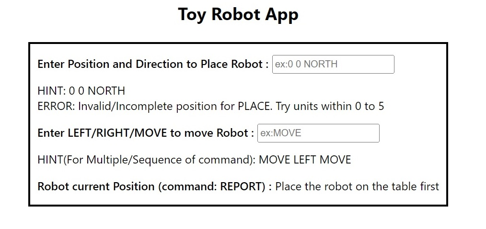

## Description
* The application is a simulation of a toy robot moving on a square table top, of dimensions 5 units x 5 units. There are no
other obstructions on the table surface. The robot is free to roam around the surface of the table, but must be prevented
from falling to destruction. Any movement that would result in the robot falling from the table must be prevented,
however further valid movement commands must still be allowed.  
Commands accepted by application are following:
  - PLACE X,Y,F  
  - MOVE  
  - LEFT  
  - RIGHT  
  - REPORT  
* PLACE will put the toy robot on the table in position X,Y and facing NORTH, SOUTH, EAST or WEST. 
* The origin (0,0) can be considered to be the SOUTH WEST most corner.  
* The first valid command to the robot is a PLACE command, after that, any sequence of commands may be issued, in any order, including another PLACE command. The application should discard all commands in the sequence until a valid PLACE command has been executed.  
* MOVE will move the toy robot one unit forward in the direction it is currently facing. 
* LEFT and RIGHT will rotate the robot 90 degrees in the specified direction without changing the position of the robot. 
* REPORT will announce the X,Y and F of the robot, and it will be shown in UI. 
* A robot that is not on the table can choose the ignore the MOVE, LEFT, RIGHT and REPORT commands.

## How to run this Project on Local
git clone [git repo link]  
cd path(go to file dir)  
npm install  
npm start  
Enter Position and Direction to place Robot in input field. Example: 0 0 NORTH  
Enter LEFT/RIGHT/MOVE to move Robot in input field. Example: MOVE  
For Multiple/Sequence of command to move robot use this format: MOVE LEFT MOVE  

### `npm start`

Runs the app in the development mode. 
Open [http://localhost:3000](http://localhost:3000) to view it in the browser.

The page will reload if you make edits. 
You will also see any lint errors in the console.

### `npm test`
Launches the test runner in the interactive watch mode.

### `npm test -- --coverage`
Launches the test runner for coverage of test cases

